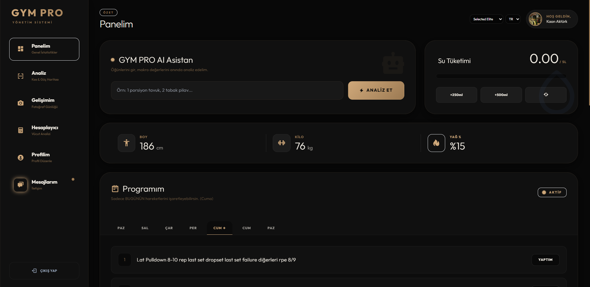
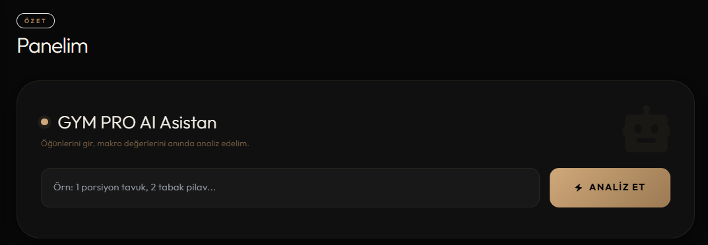
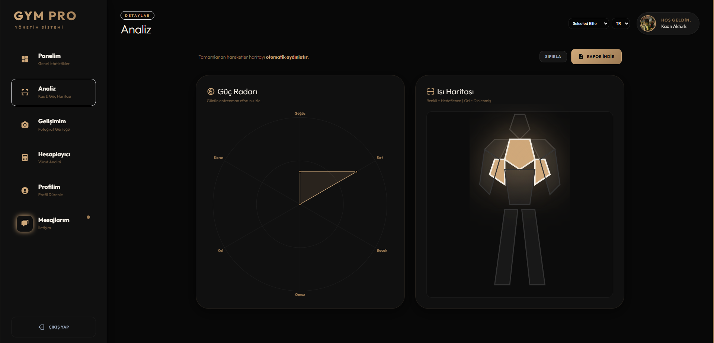
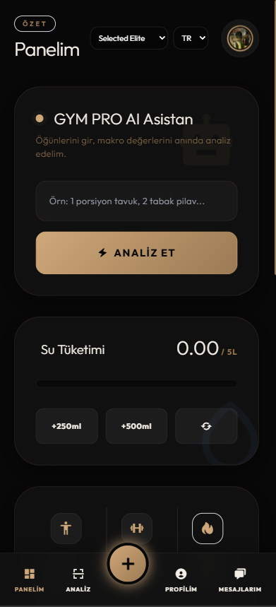
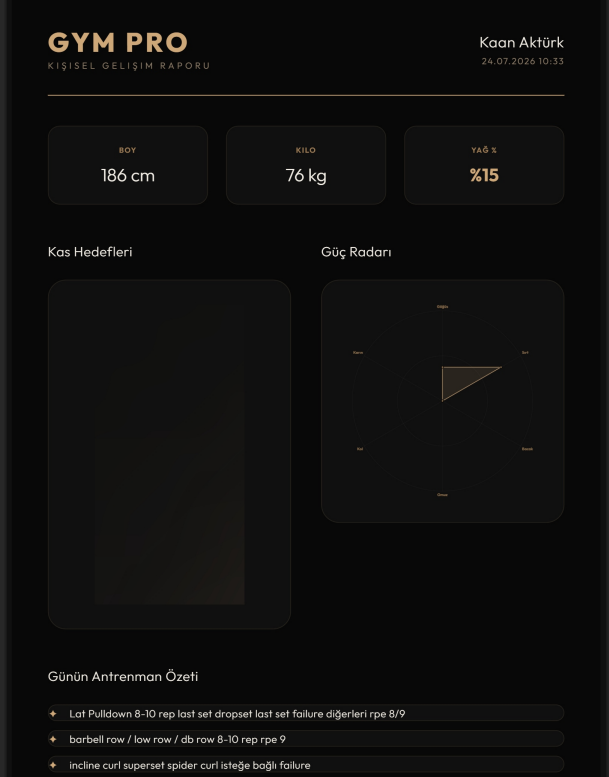

# ⚡ GYM PRO - All-in-One Spor Salonu Yönetim ve Otomasyon Sistemi

     

**GYM PRO**, geleneksel spor salonu yönetim süreçlerinin getirdiği operasyonel hantallığı, dağınık veri yapısını ve güvenlik zafiyetlerini ortadan kaldırmak amacıyla **katmanlı MVC (Model-View-Controller) mimarisi** ile sıfırdan geliştirilmiş modern bir web otomasyon sistemidir.

Sistem; Yönetici (Admin), Eğitmen (Personal Trainer) ve Üye (Member) rollerini tek bir dijital merkezde buluşturarak yüksek performanslı, ölçeklenebilir ve yapay zeka destekli bir spor salonu ekosistemi sunar.

---

## 📸 Uygulama Arayüzleri ve Ekran Görüntüleri

Projede Tailwind CSS, Glassmorphism (cam efekti) ve karanlık/aydınlık tema motoru (Dark/Light Mode) kullanılarak yüksek UI/UX standartları sağlanmıştır.

| **Dashboard & Tema Motoru** | **AI Beslenme Asistanı** |
| --- | --- |
|  |  |
| **Güç Radarı & Kas Isı Haritası** | **PT Program Editörü** |
|  |  |
| **Mobil Uyumlu Arayüz** | **PDF Gelişim Raporu** |
|  |  |

---

## 🌟 Öne Çıkan Özellikler

### 🖥️ Genel Kullanıcı Paneli
- Kullanıcının genel istatistiklerini, su tüketimini ve aktif programlarını takip edebildiği ana arayüz
- Sayfa yenilenmeden runtime'da değiştirilebilen **Classic Pro**, **Aggressive Red** ve **Selected Elite** olmak üzere 3 dinamik tema

### 🤖 Yerel Yapay Zeka (AI) Beslenme Asistanı
- Harici, gecikme yaratan ve maliyetli API'ler yerine doğrudan istemci tarafında çalışan **Kural Tabanlı Doğal Dil İşleme (NLP)** algoritması
- Kullanıcı yediklerini doğal dille yazdığında (örn. *"2 tabak makarna, 200 gram tavuk"*) özel **RegEx motoru** metni tarar, ölçü birimlerini (tabak, gram, porsiyon) matematiksel katsayılara çevirir
- Yerel veri sözlüğü (JSON) ile eşleşen besinlerin kalori ve makro değerleri (protein, karbonhidrat, yağ) milisaniyeler içinde hesaplanıp dinamik grafiklere yansıtılır

### 📊 Detaylı Analiz Paneli: Güç Radarı & Kas Isı Haritası
- Egzersiz listesinden işaretlenen hareketlerin (örn. "Bench Press") RegEx taramasıyla hangi kas grubunu çalıştırdığı tespit edilir
- Özel **SVG insan anatomisi poligonlarında** otomatik aydınlatma ve efor verisinin **Chart.js Güç Radarı**na yansıtılması

### 📅 Eğitmenler (PT) İçin Haftalık Antrenman Programı Editörü
- Eğitmenlerin üyelerine özel haftalık egzersiz rutini, set ve tekrar sayılarını atadığı interaktif yönetim paneli
- Veritabanını yormamak adına bu veriler bütünleşik bir **JSON şablonu** olarak saklanır

### 📱 Mobil Uyumlu (Responsive) Arayüz
- CSS3 Flexbox, Grid ve Media Query'ler ile masaüstü, tablet ve akıllı telefon ekranlarında kusursuz hizalama

### 📄 Dinamik PDF Kişisel Gelişim Raporu
- Fiziksel ölçüm verilerinin, kas haritasının ve güç radarının `html2pdf.js` ve Canvas mimarisiyle tek tıkla resmi bir A4 raporuna dönüştürülmesi

---

## 🔐 Güvenlik Mimarisi

OWASP web güvenliği standartlarına uygun olarak sertleştirilmiştir:

- **SQL Injection Koruması:** Veritabanı katmanında yalnızca **PDO (Prepared Statements)** kullanılır, dinamik sorgu birleştirme yapılmaz
- **XSS Koruması:** İstemci-sunucu arası tüm girdi/çıktılar `htmlspecialchars` ve veri izolasyon filtrelerinden geçirilir
- **2FA & OTP Doğrulama:** Kayıt sırasında sahte hesapları engellemek için **PHPMailer & SMTP (TLS 1.2)** ile çalışan 6 haneli tek kullanımlık şifre (OTP) doğrulaması
- **Oturum Güvenliği:** Session hijacking/fixation saldırılarına karşı `session_regenerate_id(true)`, **HttpOnly**, **Secure** ve **SameSite=Strict** çerez politikaları
- **RBAC (Rol Tabanlı Erişim Kontrolü):** Admin, PT ve Üye yetkileri Controller katmanında denetlenir, yetkisiz URL erişimleri anında engellenir

---

## 🛠️ Teknik Mimari ve Veritabanı Tasarımı

Proje, **Separation of Concerns** prensibine dayanan **MVC** mimarisi ile kodlanmıştır:

```
GYM-PRO/
├── app/                  # MVC katmanı (Model / View / Controller)
│   ├── models/           # PDO veritabanı bağlantıları, veri doğrulama, iş mantığı
│   ├── views/            # Tailwind CSS ile oluşturulan modüler arayüz şablonları
│   └── controllers/      # İstemci isteklerini yönlendiren Router ve işleyiciler
├── public/               # Genel erişime açık dosyalar
│   └── assets/
│       ├── img/          # Ekran görüntüleri ve statik görseller
│       ├── css/          # Tailwind çıktısı ve özel stiller
│       └── js/           # AI asistan, grafik ve tema motoru script'leri
├── database.sql          # Veritabanı şeması (tablolar, ilişkiler, indeksler)
├── db.txt                # Veritabanı bağlantı/kurulum notları
├── .htaccess             # Apache yönlendirme ve URL rewrite kuralları
└── README.md
```

- **Model:** PDO veritabanı bağlantıları, veri doğrulama ve SQL iş mantığı
- **View:** Tailwind CSS ile oluşturulan modüler arayüz şablonları
- **Controller:** HTTP isteklerini yönlendiren Router ve işleyiciler

### ⚡ Veritabanı Optimizasyonları

- **NoSQL Yaklaşımlı JSON Depolama:** Yüzlerce üyenin antrenman programı için veritabanını yoran JOIN sorguları yerine, `programs` tablosundaki `program_details` sütununda haftalık egzersizler tek bir bütünleşik JSON şablonu olarak saklanır — bu sayede sunucu I/O yükü %80 azaltılmıştır
- **Kompozit İndeksleme & Triggers:** `water_log` (hidrasyon takibi) ve `user_stats` tablolarında `user_id` ve `date` üzerinde kompozit indeksler kurularak arama hızları milisaniyeler seviyesine indirilmiştir; su takibinde `ON DUPLICATE KEY UPDATE` mantığıyla sunucu dostu kayıt algoritması uygulanmıştır
- **İstemci Önbellekleme:** Sunucuyu (MySQL) tekrarlı SELECT sorgularından korumak için kullanıcının gelişim ve grafik verileri **LocalStorage API** üzerinde JSON formatında önbelleğe alınır

---

## 🚀 Kurulum ve Çalıştırma Kılavuzu

### 1. Gereksinimler

- **PHP:** 8.0 veya üzeri
- **Veritabanı:** MySQL / MariaDB
- **Sunucu:** Apache (XAMPP / WAMP / Laragon önerilir)
- **Composer:** PHPMailer gibi bağımlılıkların yönetimi için

### 2. Projeyi Kopyalayın (Clone)

```bash
git clone https://github.com/kaanjsx/GYM-PRO.git
cd GYM-PRO
```

### 3. Bağımlılıkları Kurun

```bash
composer install
```

### 4. Veritabanını Oluşturun

1. phpMyAdmin veya MySQL CLI üzerinden yeni bir veritabanı oluşturun
2. `database.sql` dosyasını içe aktararak tabloları ve ilişkileri kurun:

```bash
mysql -u root -p gym_pro < database.sql
```

3. `db.txt` dosyasındaki bağlantı bilgilerine göre veritabanı kullanıcı adı, şifre ve host ayarlarını `app/` içindeki config dosyasında güncelleyin

### 5. Ortam Ayarları

- **SMTP / PHPMailer:** OTP doğrulama e-postalarının gönderilebilmesi için SMTP bilgilerinizi (host, port, kullanıcı, şifre) ilgili config dosyasına girin
- **.htaccess:** Apache üzerinde `mod_rewrite` modülünün etkin olduğundan emin olun

### 6. Build & Run

Proje klasörünü sunucunuzun kök dizinine (örn. `htdocs/` veya `www/`) yerleştirip Apache'yi başlatın, ardından tarayıcıdan `http://localhost/GYM-PRO` adresine gidin.

---

## ⚠️ Bilinen Sınırlamalar

- AI beslenme asistanı harici bir dil modeli kullanmaz; RegEx tabanlı kural motoruyla çalıştığı için yerel veri sözlüğünde (JSON) bulunmayan besinleri tanıyamaz
- OTP doğrulaması için SMTP ayarlarının doğru yapılandırılması gerekir; aksi halde e-posta gönderimi başarısız olur
- Tema motoru ve LocalStorage önbelleği tarayıcı bazlıdır; farklı cihaz/tarayıcıda giriş yapıldığında sıfırlanır

---

## 🧰 Teknolojiler

`PHP 8.x` · `MySQL / MariaDB` · `PDO` · `Tailwind CSS` · `JavaScript (ES6+)` · `Chart.js` · `html2pdf.js` · `PHPMailer` · `Composer` · `Apache`

## 📄 Lisans

Bu proje [MIT Lisansı](LICENSE) altında lisanslanmıştır.
